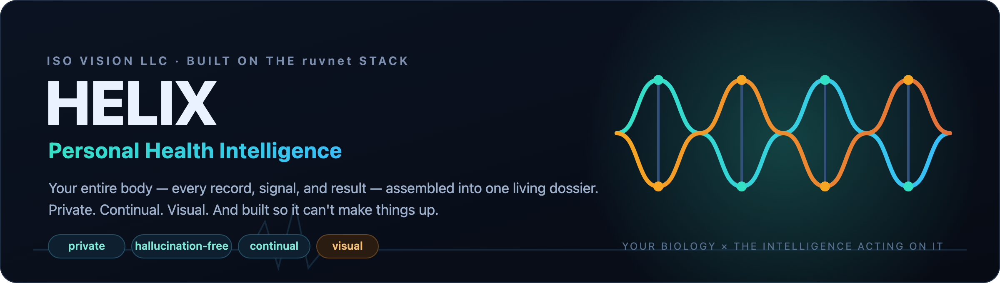
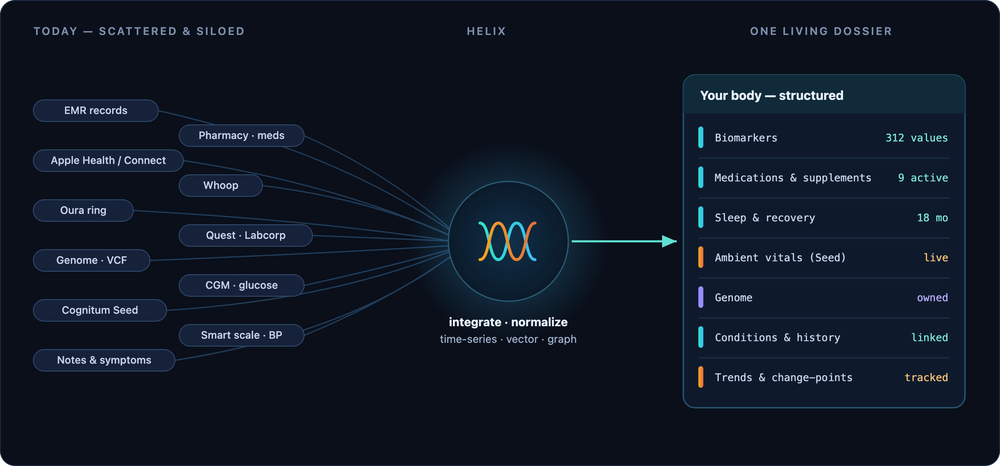
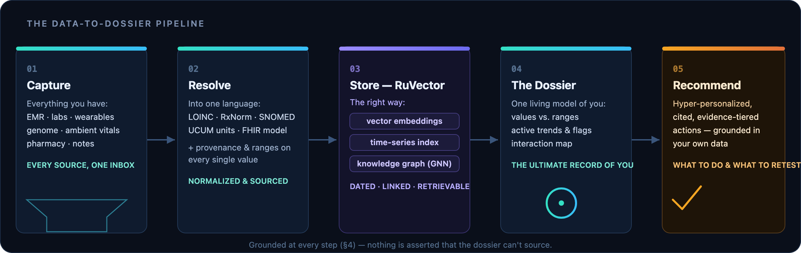
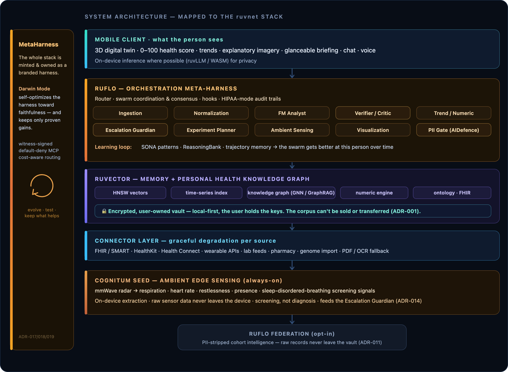
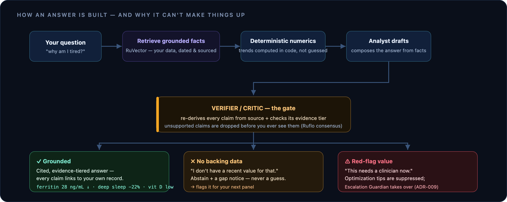
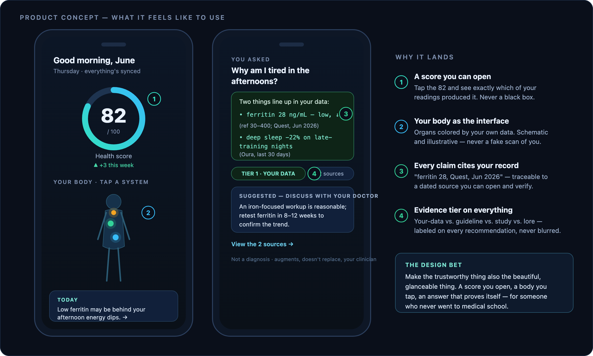

# HELIX — Personal Health Intelligence Platform
### ADR-Driven Product Specification

*Two strands, one thread: the cool strand is **your biology** (the continuous signal); the warm strand is **the intelligence** acting on it. Helix is where they intertwine.*

> **Working codename:** *Helix* · **Brand candidate:** **PHI — Personal Health Intelligence** (a deliberate play on *Protected Health Information*: the same data, turned from a liability you store into intelligence you own).
> **Platform substrate:** Ruflo (agent meta-harness) + RuVector (vector / GNN / GraphRAG memory DB) + Cognitum Seed (always-on edge sensing) + MetaHarness/Darwin (self-optimizing branded harness)
> **Prepared by:** ISO Vision LLC
> **Status:** v1.0.0 — Proposed · **Document type:** Product spec + Architecture Decision Records (with embedded architecture & concept diagrams)
> **What's in v1.0.0:** The whole thing in one place, made *visual*. New embedded SVG diagrams show how the pieces hang together end-to-end — the data‑to‑dossier pipeline, the complete ruvnet‑mapped system architecture, the anti‑hallucination answer flow, and a concept of the product itself. Substantively this carries forward v0.2's four capability layers: ambient sensing (Cognitum Seed), the 3D visual layer, the self‑optimizing harness (MetaHarness + Darwin Mode), and the grounded differentiation from **OpenAI's ChatGPT Health** (launched Jan 7, 2026). The thesis in one line: *nothing like this exists yet — the parts are all out there, but no one has assembled them into a single living dossier the average person can actually use.*

---

## 0. Executive summary

Helix is a **mobile-first "functional-medicine specialist in your pocket."** It ingests *everything* a person can know about their own body — electronic medical records, pharmacy history, phone and wearable telemetry, genome, lab panels, sleep, recovery, nutrition, subjective logs — normalizes it into a single, structured, longitudinal **personal health knowledge graph**, and puts a conversational, multi-agent analyst on top of it.

The differentiator is not "another health chatbot." It is that **every answer is grounded in the user's own data, traceable to its source, graded for evidence quality, and bounded by an explicit refuse-when-unknown policy.** Ask "why am I tired in the afternoons?" and you don't get a generic listicle — you get an answer that cites *your* ferritin trend, *your* deep-sleep minutes from the last 30 days, *your* vitamin D level against the reference range, and *your* medication timing, with each claim tagged by where it came from and how confident the system is.

**v0.2 raises the ambition in four ways:**

- **It senses, not just imports.** A **Cognitum Seed** — an always-on edge AI device — passively and contactlessly tracks breathing, heart rate, restlessness, and sleep-disordered-breathing signals (via mmWave radar) in the background, with no wearable to charge and no data leaving the home. The analyst gains a *continuous* signal, not just what you remember to upload (§11, ADR-014).
- **It shows, not just tells.** A **world-class 3D visual layer** turns the graph into something the 99.9% of people who are *not* physicians can actually understand: an interactive anatomical "digital twin," a transparent **0–100 health score**, and trend visualizations that make "how am I doing, and which way am I heading?" obvious at a glance (§12, ADR-015/016).
- **It improves itself.** Helix is *minted* as a branded, repo-tuned harness via **MetaHarness**, and runs **Darwin Mode** — it safely mutates its own configuration in a sandbox and keeps only changes that *measurably* improve grounding and faithfulness, while the underlying model stays frozen (§13, ADR-017/018/019).
- **It is for everyone.** Not just biohackers. The design target is a person who wants to **dump everything they have into one place and have it just work** — produce a clear picture, honest answers, and a few concrete next steps. Optimization depth is available for those who want it; clarity is the default for those who don't.

**And it is deliberately *not* ChatGPT Health.** OpenAI launched ChatGPT Health on January 7, 2026 — a cloud-based health tab built on b.well's FHIR network and tuned with 260+ physicians. It is a strong product and a useful reference point, but it is cloud-resident (subpoena-reachable), explicitly *not* HIPAA-covered, comes from a company openly moving toward advertising, and is fundamentally a general LLM in a sandbox. Helix differs on the axes people actually care about: **private (local-first, user-owned), continually sensing, architecturally anti-hallucination, and visual.** Full comparison in §14.

Today this exists only in fragments — Apple Health, Oura/Whoop apps, lab portals, pharmacy apps, the occasional functional-medicine practitioner spreadsheet. Helix unifies the fragments and makes the unified whole *interrogable*.

This document specifies the full capability wish list, the reference architecture on Ruflo + RuVector, and the key architecture decisions (ADRs) — with particular weight on the three things that make or break a product in this space: **anti-hallucination / data-grounding**, **privacy and data ownership**, and **clinical safety**.

---

## 1. Problem & product thesis

### 1.1 The fragmentation problem
A motivated person optimizing their health in 2026 juggles 8–15 disconnected silos:

- An **EMR/patient portal** per provider (MyChart and friends), each a walled garden.
- A **pharmacy app** with refill history but no analytic layer.
- **Apple Health / Android Health Connect** aggregating phone + some wearables.
- **Wearable-native apps** (Whoop, Oura, Garmin, Eight Sleep) each with its own score and its own opinion.
- **Lab portals** (Quest, Labcorp, Function Health) holding PDFs and the occasional API.
- **Genetic data** (formerly 23andMe — see §7.4 for why that's now a cautionary tale), raw FASTQ/VCF files, or nothing.
- **Spreadsheets and notebooks** where the person manually tries to connect the dots.

No single layer reasons across all of it. The "connecting the dots" is left to the human — exactly the task a person is least equipped to do well and most prone to do with confirmation bias.

**This is the gap.** The parts all exist; nobody has assembled them. **Figure 1** is the whole pitch in one image: a person's scattered, disconnected health data on the left, pulled through Helix, and emerging as a single structured, queryable dossier of their own body on the right.

**Figure 1 — From scattered silos to one living dossier.** *The pieces on the left already exist in the world — scattered across a dozen apps and portals. Helix is the part nobody has built: the synthesis that turns them into a single, structured, queryable record of **you**.*

### 1.2 The thesis
> If you give a sufficiently capable analyst **complete, structured, longitudinal context** about one person, and constrain it to **answer only from that context with full provenance**, you get something qualitatively different from a chatbot: a personal health intelligence that produces **specific, data-centric, low-hallucination** guidance.

The two ruvnet primitives map directly onto this:

- **RuVector** is the *substrate of context* — a self-learning vector + graph memory DB that stores every datum with provenance and links them into a personal health knowledge graph (GraphRAG), enabling "what connects to what" reasoning.
- **Ruflo** is the *substrate of reasoning* — a multi-agent meta-harness that coordinates specialist agents (ingestion, normalization, the functional-medicine analyst, a verifier/critic, an escalation guardian), with built-in PII-gating, evidence/learning loops (SONA, ReasoningBank), and HIPAA/SOC2/GDPR-mode audit trails.

---

## 2. Product capability wish list (requirements)

Organized in four tiers. This is the "everything and anything" list, made rigorous.

### Tier A — Ingestion (get all of it in)
Every source the user listed, plus the obvious adjacencies. **A0 is new in v0.2: passive, always-on sensing that requires nothing of the user.**

| # | Domain | Sources (examples) | Notes |
|---|--------|--------------------|-------|
| **A0** | **Ambient passive sensing** | **Cognitum Seed** edge device + mmWave radar (e.g., HLK-LD6004 / LD2450 class); optional bedside/room placement | Contactless respiration rate, heart rate, motion/restlessness, presence, and **sleep-disordered-breathing screening signals** — continuous, no wearable, fully on-device (§11, ADR-014) |
| A1 | **Clinical records (EMR)** | Patient-portal records via FHIR / SMART Health Links; Apple Health Records; CCDA documents | The clinical backbone — diagnoses, encounters, vitals, immunizations, clinical notes |
| A2 | **Pharmacy / medications** | Pharmacy refill history, e-prescribing networks, manual entry, OTC + supplement logging | Active meds, adherence, interaction surface, supplement stack |
| A3 | **Smartphone health hub** | Apple HealthKit (iOS), Android Health Connect (the successor to the deprecated Google Fit) | Steps, HR, HRV, workouts, mobility, audio exposure, cycle tracking, mindful minutes |
| A4 | **Wearables & devices** | Whoop, Oura, Garmin, Apple Watch, Eight Sleep, Withings, Dexcom/CGM, blood-pressure cuffs, smart scales | Recovery, strain, sleep stages, SpO₂, temperature, continuous glucose |
| A5 | **Genomics** | Raw genotype/VCF/FASTQ files the user *owns*; methylation/epigenetic clocks | **Stored locally and user-owned** — never a third-party DTC vault (§7.4) |
| A6 | **Labs & diagnostics** | Quest, Labcorp, Function Health, hospital labs; PDF parsing + structured feeds where available | Blood panels, hormones, lipids, inflammatory markers, micronutrients, biological-age tests |
| A7 | **Subjective & lifestyle** | Nutrition logs, mood/energy journaling, symptom logs, menstrual/perimenopause tracking, alcohol/caffeine, environment (air quality, light exposure) | The "ground truth" of how the person actually feels — critical for correlation |
| A8 | **Imaging & specialty** (later) | DEXA, VO₂max tests, coronary calcium, microbiome panels, continuous ketone | Episodic but high-value |

### Tier B — Normalization & the personal health knowledge graph
- **B1.** Map every incoming datum to canonical ontologies: **LOINC** (labs), **RxNorm** (meds), **SNOMED CT / ICD-10** (conditions), **UCUM** (units), with **FHIR R4/R5** as the interchange model.
- **B2.** Attach **provenance** to every fact: source system, timestamp, measurement method, units, reference range, confidence.
- **B3.** Build a **personal health knowledge graph** in RuVector linking biomarkers ↔ conditions ↔ medications ↔ interventions ↔ wearable signals ↔ subjective states.
- **B4.** **Temporal layer** — every metric is a time series; trends, slopes, and change-points are first-class, not afterthoughts.
- **B5.** **De-duplication & reconciliation** across overlapping sources (e.g., Apple Watch HR vs. Whoop HR).

### Tier C — The analyst (the functional-medicine front end)
- **C1.** **Standing health model**: a continuously maintained, structured picture of the user — current biomarkers vs. ranges, flagged out-of-range values, active trends, risk surfaces, medication/supplement interaction map.
- **C2.** **Proactive insights**: "Your vitamin D dropped below range over the last two draws"; "Deep sleep is down 22% on nights you train after 7pm"; "Your resting HR has trended up 6 bpm in three weeks."
- **C3.** **Recommended actions**, evidence-tiered (see §4): what to do, why, what evidence supports it, and what to retest to confirm.
- **C4.** **Goal-oriented optimization**: user sets goals (energy, longevity markers, body composition, athletic performance); the system plans interventions and tracks whether they moved the needle, using Ruflo's GOAP planner.
- **C5.** **Closed-loop experimentation**: structured n-of-1 experiments ("try X for 4 weeks, here are the metrics we'll watch, here's the readout").

### Tier D — The conversational interface
- **D1.** Natural-language Q&A grounded entirely in the user's graph, with **inline citations to their own records**.
- **D2.** **Abstention by design**: "I don't have a recent testosterone value — your last is 14 months old. Want me to flag it for your next panel?" instead of guessing.
- **D3.** **"Prep for my appointment"**: generate a clinician-ready summary of changes, questions, and flagged values.
- **D4.** Voice + mobile-native, glanceable daily briefing, push for red-flag values.

### How it works, end to end

Everything above flows through one pipeline: capture it all, resolve it into a common language, store it *the right way* (vectors + time-series + a knowledge graph), assemble it into a living dossier, and turn that dossier into specific, cited recommendations.

**Figure 2 — The data-to-dossier pipeline.** *Cool stages are your data going in; the violet stage is how RuVector stores it so it can be reasoned over; the warm stage is the intelligence coming back out. The dossier in the middle is the asset — the ultimate record of one body.*

---

## 3. Reference architecture (Ruflo + RuVector)

**Figure 3 — System architecture, mapped to the ruvnet stack.** *The full stack. Read it bottom-up for data (the Seed and connectors feed RuVector's vault and graph) and top-down for questions (the client asks, Ruflo's swarm reasons, RuVector grounds the answer). The amber rail on the left is MetaHarness: the whole thing is minted as a harness Helix owns, and Darwin Mode keeps tuning it toward faithfulness.*

### Agent roster (why a swarm, not one model)
A single model answering health questions from a pile of text is exactly the hallucination risk to avoid. Ruflo lets us decompose:

- **Ingestion agents** — one per connector, fault-tolerant, idempotent.
- **Normalization agent** — maps to canonical ontologies, attaches provenance, rejects un-mappable data into a review queue rather than silently coercing it.
- **Trend/Numeric agent** — *deterministic* computation of slopes, deltas, reference-range crossings, correlations. The LLM never does arithmetic on health data (ADR-007).
- **Functional-Medicine Analyst** — the reasoning front end; retrieves grounded facts and composes insights/recommendations.
- **Verifier/Critic agent** — independently checks every analyst claim against source data and evidence tier before it reaches the user (ADR-008).
- **Escalation Guardian** — watches for red-flag values and routes to "see a clinician now" (ADR-009).
- **Experiment Planner** — GOAP-based n-of-1 design and tracking.
- **Ambient Sensing agent** — runs on/with the Cognitum Seed; extracts vitals locally, detects anomalies, emits screening flags (ADR-014).
- **Visualization agent** — translates the graph into the 3D twin, the 0–100 score, trends, and grounded explanatory imagery (ADR-015/016).
- **Privacy/PII gate (AIDefence)** — strips/blocks PII on any egress, including federation and any external LLM call.

---

## 4. The anti-hallucination / data-centric answering design *(the core differentiator)*

This is the part most "AI health" products get wrong. Helix treats grounding as an architectural mandate, not a prompt-engineering hope.

**Figure 4 — The grounded answering flow.** *The gate is the point. An answer only reaches you if it can be re-derived from your own data; if it can't, Helix says so instead of inventing one; and if a value is dangerous, optimization stops and escalation begins.*

1. **Retrieval-grounded, provenance-required answering.** Every factual claim in a response must resolve to a stored datum in RuVector carrying source + timestamp + units + reference range. No backing datum → the claim is not made.

2. **No-data-no-claim / abstention.** The analyst is explicitly permitted — and rewarded — for saying "I don't have that." Missing, stale, or low-confidence data triggers a *gap notice* ("your last lipid panel is 14 months old"), not a guess.

3. **Deterministic numeric offload.** Trends, averages, percent-changes, range crossings, and correlations are computed by the Trend/Numeric agent in code, then *handed to* the LLM as facts. LLMs are unreliable at arithmetic over time series; we don't ask them to.

4. **Evidence tiering on every recommendation.** Each piece of guidance is labeled by the strength of what it rests on:
   - **Tier 1 — Your data:** directly from the user's own measurements.
   - **Tier 2 — Reference standards:** population reference ranges, clinical guidelines.
   - **Tier 3 — Peer-reviewed literature:** cited studies (with effect-size and population caveats).
   - **Tier 4 — Heuristic / emerging ("biohacker lore"):** explicitly flagged as low-evidence so it's never dressed up as established fact.

5. **Multi-agent verification.** The Verifier/Critic agent re-derives each claim from source data and rejects or down-grades anything it can't substantiate, using Ruflo swarm consensus for clinically meaningful outputs.

6. **Temporal grounding.** Answers reason over trends, not single points — and surface the time window and sample size behind any trend claim.

7. **Confidence calibration & graceful uncertainty.** Responses carry calibrated confidence; the UI distinguishes "this is solid" from "this is a weak signal worth retesting."

8. **Graph-aware reasoning.** RuVector's GNN/GraphRAG lets the analyst traverse *relationships* (this biomarker ↔ this symptom ↔ this medication's known effect) rather than pattern-matching free text — reducing spurious associations.

> Net effect for the user: highly specific, data-centric answers, with a visible audit trail, and an honest "I don't know yet" where the data is silent.

---

## 5. Integration matrix (mechanisms & current-state caveats)

> ⚠️ APIs in this space change frequently and several require partner agreements or per-source approval. The connector layer (ADR-012) is built for **graceful degradation** — when a clean API isn't available, fall back to user-initiated export + PDF/OCR import. Treat the "mechanism" column as the *target*; verify each at build time.

| Source | Primary mechanism | Caveats to verify |
|--------|-------------------|-------------------|
| EMR / clinical | FHIR R4/R5 via SMART on FHIR; Apple Health Records; SMART Health Links/Cards | Per-provider onboarding; patient-mediated access; scope of available resources varies |
| Apple Health | HealthKit (on-device, user-authorized) | iOS only; granular per-type consent; background delivery limits |
| Android | **Health Connect** (Google Fit APIs deprecated) | Confirm current Health Connect API surface and which OEMs route through it |
| Whoop / Oura / Garmin / etc. | Vendor developer APIs (OAuth) | Rate limits, ToS on derived metrics, some require commercial agreements |
| CGM (Dexcom etc.) | Vendor API | Often gated; regulatory sensitivity around glucose |
| Labs (Quest/Labcorp/Function) | Structured feeds where available; otherwise PDF + OCR + LOINC mapping | Consumer API availability is uneven; PDF fallback is essential |
| Pharmacy / meds | E-prescribing/refill data where accessible; manual + barcode entry fallback | Direct consumer pharmacy APIs are limited; design for manual + OTC/supplement entry |
| Genome | **User-owned file import** (VCF/raw genotype) | Do **not** depend on a third-party DTC account as the system of record (§7.4) |

---

## 6. Architecture Decision Records

Each ADR: **Context → Decision → Consequences.** These are the load-bearing choices.

### ADR-001 — User-owned, local-first encrypted health vault
**Context.** Health + genomic data is the most sensitive data a person has. The 2025 collapse of 23andMe — Chapter 11, its 15M-person genetic database sold for $305M, and the fact that it was *not* HIPAA-covered as a direct-to-consumer company — is the canonical cautionary tale (§7.4). A centralized vendor vault is both a breach target and a bankruptcy asset.
**Decision.** Helix stores the canonical copy of a user's data in an **encrypted, user-owned vault**, local-first on device with optional user-controlled encrypted sync/backup. The user holds keys. Helix the company is structured to *never* be able to monetize or transfer the raw corpus.
**Consequences.** (+) Strongest possible privacy posture and a genuine market differentiator; resilient to vendor failure. (−) Harder cross-device sync, backup/recovery UX, and "lost keys" handling; constrains certain server-side ML. Mitigate with on-device inference (ADR-013) and opt-in, PII-stripped federation (ADR-011).

### ADR-002 — Ruflo as the orchestration meta-harness
**Context.** The product is irreducibly multi-step and multi-specialty (ingest → normalize → analyze → verify → escalate). One monolithic prompt cannot safely own all of it.
**Decision.** Use **Ruflo** as the agent meta-harness: specialist agents, swarm coordination/consensus, hooks, the SONA/ReasoningBank learning loop, AIDefence PII-gating, and HIPAA-mode audit trails.
**Consequences.** (+) Clean separation of concerns; built-in verification, learning, security, and audit; multi-provider LLM routing with failover. (−) Operational complexity; dependency on a fast-moving open-source project (pin versions, vendor-risk plan).

### ADR-003 — RuVector as memory + personal health knowledge graph
**Context.** Grounded answering requires fast retrieval over provenance-tagged facts *and* relationship reasoning across biomarkers/conditions/interventions.
**Decision.** Use **RuVector** for HNSW vector memory, GraphRAG, and GNN-based relationship reasoning, with a temporal time-series index. It is the system of record's analytic layer.
**Consequences.** (+) Sub-ms retrieval, graph reasoning, self-learning memory in one Rust substrate; WASM path supports on-device. (−) Graph schema design is significant up-front work; team must build health-domain ontology mapping on top.

### ADR-004 — Canonical ontology normalization layer
**Context.** The same concept arrives in a dozen formats and units across sources. Reasoning over un-normalized text invites error.
**Decision.** Normalize *everything* to **LOINC / RxNorm / SNOMED CT / ICD-10 / UCUM**, with **FHIR** as the interchange model, before it enters the analytic graph. Un-mappable data goes to a human-review queue, never silently coerced.
**Consequences.** (+) Reliable, interoperable, clinician-legible data; far less ambiguity for the analyst. (−) Mapping is laborious and ongoing; needs maintained code systems and a review workflow.

### ADR-005 — Retrieval-grounded, provenance-required answering
**Context.** Hallucinated health claims are dangerous. (See §4.)
**Decision.** Every factual claim must resolve to a stored datum with provenance; un-backed claims are suppressed. Citations to the user's own records are surfaced inline.
**Consequences.** (+) Trust, auditability, the core differentiator. (−) More "I don't have that" responses (a feature, but a UX education task); requires disciplined retrieval plumbing.

### ADR-006 — Evidence tiering & explicit abstention policy
**Context.** Functional-medicine / longevity guidance ranges from rock-solid to speculative lore. Conflating tiers is how products mislead.
**Decision.** Label every recommendation Tier 1–4 (§4.4); permit and reward abstention; never present Tier-4 lore as established fact.
**Consequences.** (+) Honest, defensible guidance; lower liability. (−) Some users want confident answers and may find tiering "wishy-washy" — handle with good design.

### ADR-007 — Deterministic numeric/trend engine
**Context.** LLMs miscompute over time series.
**Decision.** All quantitative work (trends, deltas, range crossings, correlations) is computed deterministically by the Trend/Numeric agent and handed to the LLM as facts.
**Consequences.** (+) Numerically trustworthy. (−) Must build/maintain the stats engine; clear contract between numeric layer and analyst.

### ADR-008 — Verifier/critic agent + swarm consensus for clinical outputs
**Context.** A single agent can be confidently wrong.
**Decision.** A second, independent agent re-derives and checks each clinically meaningful claim against source data and evidence tier; Ruflo consensus gates the output.
**Consequences.** (+) Catches fabrication and overreach before the user sees it. (−) Added latency/cost; tune which outputs require full verification.

### ADR-009 — Red-flag escalation & clinician-in-the-loop
**Context.** Some values (e.g., dangerously abnormal labs, cardiac signals) demand "see a professional now," not optimization tips.
**Decision.** The Escalation Guardian monitors for red-flag thresholds and short-circuits to urgent-care guidance; the product positions itself as *augmenting*, never replacing, clinicians.
**Consequences.** (+) Safety and trust. (−) Threshold curation is an ongoing clinical-governance task; requires medical advisory input.

### ADR-010 — Wellness positioning vs. SaMD regulatory boundary
**Context.** Crossing from "general wellness / information" into diagnosis or treatment recommendations can make the product a regulated medical device (SaMD) under FDA and analogous regimes.
**Decision.** Ship initially as a **general-wellness / decision-support** product with clear non-diagnostic framing; treat any diagnostic/treatment feature as a deliberate, separately-regulated track with counsel and clinical governance.
**Consequences.** (+) Faster, lower-risk launch. (−) Constrains some claims and features; requires careful copy and clinical oversight. *Get regulatory counsel early; this is not legal advice.*

### ADR-011 — Federation for opt-in, PII-stripped cohort intelligence
**Context.** Population context ("people like you who corrected low vitamin D saw X") is valuable but must never leak raw personal data.
**Decision.** Use **Ruflo federation** — PII stripped before egress, behavioral trust scoring, HIPAA/GDPR audit modes — for *opt-in* aggregate/cohort signals only. Raw records never leave the user's vault.
**Consequences.** (+) Network-effect intelligence with privacy preserved. (−) Aggregation/anonymization must be genuinely robust (re-identification risk is real); opt-in by default.

### ADR-012 — Connector abstraction with graceful degradation
**Context.** Source APIs are uneven, gated, and change often.
**Decision.** A uniform connector interface; when a clean API is unavailable, fall back to user-initiated export + PDF/OCR import. Each connector is independently versioned and fault-isolated.
**Consequences.** (+) Resilience; ship value before every API is wired. (−) Many connectors to maintain; OCR/PDF parsing is messy and needs validation.

### ADR-013 — On-device inference where feasible
**Context.** Local-first data (ADR-001) pairs best with local-first compute; sending health data to cloud LLMs is a privacy and compliance exposure.
**Decision.** Prefer on-device inference (ruvLLM / WASM, RuVector's WASM path) for routine analysis; route to cloud frontier models only with explicit consent and PII-gating for the hardest reasoning.
**Consequences.** (+) Privacy, offline capability, lower marginal cost. (−) On-device model quality ceiling; hybrid routing complexity.

### ADR-014 — Ambient passive sensing via the Cognitum Seed
**Context.** Most signal is lost because data collection asks something of the user (wear it, charge it, log it). The richest health signals — overnight breathing, resting heart rate, restlessness — are exactly the ones people don't capture. The Cognitum Seed is an always-on edge AI device (on-device vector store, WASM runtime, MCP, Ed25519, OTA) that, paired with mmWave radar, can sense vitals contactlessly.
**Decision.** Add an **ambient sensing tier**: the Seed runs first-pass signal extraction and anomaly detection *locally*, streams normalized vitals into the user's vault, and never sends raw sensor data off-device. Outputs are treated as **screening signals, not diagnoses** (apnea, for example, requires polysomnography), and feed the Escalation Guardian (ADR-009).
**Consequences.** (+) Continuous, adherence-free, private signal no upload-based product can match; works for non-technical users and the elderly. (−) Radar signal processing and calibration are hard; false-positive management is critical; clear "screening, see a clinician" framing required to stay within ADR-010.

### ADR-015 — Visual health-intelligence layer (3D anatomical digital twin)
**Context.** ~99.9% of users are not clinicians. Text answers — ChatGPT Health's whole interface — under-serve comprehension. People understand their body far better when they can *see* it.
**Decision.** Build a **3D anatomical "digital twin"**: a body model whose systems/organs are color-coded by status **strictly from the user's own data**, where tapping a region reveals the underlying values, a plain-language explanation, and citations (ADR-005). Add a library of **schematic explanatory visuals** for complex topics (e.g., what ApoB is, what chronically high cortisol does), rendered at a layperson level.
**Consequences.** (+) A genuine, hard-to-copy differentiator; dramatically better comprehension and engagement-with-substance. (−) Significant 3D/mobile engineering; must follow the visualization safety principles in §12 (grounded-only, schematic, non-alarming, never a fabricated "scan" of the user).

### ADR-016 — Composite 0–100 health score: transparent, decomposable, non-diagnostic
**Context.** People want a single "how am I doing?" number — but a black-box score is both untrustworthy and potentially misleading.
**Decision.** Provide a **0–100 health score that is fully decomposable** into subsystem sub-scores (cardiometabolic, sleep, inflammation, fitness, etc.), each explaining *which of the user's data points drove it* and *which way it's trending*. The score is explicitly framed as a **wellness orientation aid, not a medical risk diagnosis** (ADR-010), and always shows its inputs and confidence.
**Consequences.** (+) Motivating, glanceable, and honest; trend-first framing nudges behavior. (−) Scoring methodology must be defensible and version-controlled; risk of false precision if not carefully communicated.

### ADR-017 — Mint Helix as a branded harness via MetaHarness
**Context.** Ruflo as a bundle freezes you and cuts you off from kernel updates if you fork to rebrand. MetaHarness factors the reusable kernel from opinionated content and mints a branded, repo-tuned harness that still pulls future kernel updates.
**Decision.** Generate Helix from the **`vertical:health` template** as a branded harness: its own CLI/identity, default-deny MCP, scoped memory, governance policy, and **Ed25519 witness-signed releases** — kernel pinned but upgradeable.
**Consequences.** (+) Own the brand and content while staying current with the engine; supply-chain provenance out of the box; default-deny security posture. (−) Beta-stage tooling (v0.1.x); pin versions and track upstream.

### ADR-018 — Darwin Mode self-optimization with faithfulness as the fitness function
**Context.** The product should get better over time without retraining a model or shipping risky changes — and it must optimize for the *right* thing.
**Decision.** Enable **Darwin Mode** (`npm run evolve`): the harness mutates its own configuration (retrieval parameters, routing tiers, prompt scaffolds, verifier thresholds), sandbox-tests each change against a held-out health-eval set, and keeps it **only if it measurably improves a DRACO-style fitness score — grounding, coverage, balance, cleanliness, faithfulness — with verifier and judge drawn from different model families** than the synthesizer. Safe by default (no network/API in the loop); opt-out with `--no-darwin`. The underlying model stays frozen.
**Consequences.** (+) Continuous, safe self-improvement aimed squarely at anti-hallucination, not engagement. (−) Requires a curated, maintained eval set (the hardest asset to build well); treat as experimental and gated.

### ADR-019 — Cost-aware model routing under privacy constraints
**Context.** Paying frontier prices for every task is wasteful; many tasks are handled well by smaller/local models — which also keeps data on-device.
**Decision.** Use a learned router (`@metaharness/router` pattern) to send each task to the **cheapest model that clears the quality bar**, preferring on-device models (ADR-013) and escalating to cloud frontier models only with consent + PII-gating. Routing policy is learned from Helix's own eval logs.
**Consequences.** (+) "Frontier-quality at a fraction of the cost"; more work stays local. (−) Routing quality depends on eval-log coverage; needs guardrails so cost optimization never overrides the faithfulness bar.

---

## 7. Privacy, security, regulatory & clinical safety

### 7.1 Data ownership & encryption
User-owned, local-first, end-to-end-encrypted vault; user holds keys; the company is architecturally unable to sell or transfer the raw corpus (ADR-001). Encrypted, user-controlled backup with a clear recovery story.

### 7.2 Regulatory landscape (verify with counsel — not legal advice)
- **HIPAA** generally applies to covered entities/business associates — *not* automatically to a direct-to-consumer app, which is precisely the gap that left 23andMe users exposed. Helix should voluntarily adopt HIPAA-grade controls and be explicit that it does so.
- **GINA** restricts genetic discrimination by employers/health insurers but does not broadly govern collection/use.
- **State genetic-privacy and consumer-privacy laws** are a patchwork; design to the strictest reasonable standard.
- **FDA SaMD** boundary per ADR-010.
- **GDPR / international** if operating beyond the US.

### 7.3 Clinical safety
Red-flag escalation (ADR-009), evidence tiering (ADR-006), explicit "augments, does not replace, a clinician" framing, and a medical advisory board to curate thresholds and review guidance logic. Helix is a decision-support and optimization tool, **not** a diagnostic authority.

### 7.4 The 23andMe lesson (why ADR-001 is non-negotiable)
In March 2025 23andMe filed for Chapter 11; a court permitted the sale of consumer data; multiple state attorneys general urged users to delete their genetic data; the database (≈15M people) was ultimately acquired by TTAM Research Institute for $305M. Because the company was a DTC entity, **HIPAA did not protect that data**, and bankruptcy law does not expressly treat genetic data as protected. The takeaway for Helix: *never* be the centralized vault whose most valuable asset is a saleable pile of other people's biology. User-owned, local-first storage is the architectural answer.

---

## 8. Phased roadmap

| Phase | Theme | Scope |
|-------|-------|-------|
| **0 — Foundation** | Vault + graph + one source, minted as a harness | Mint Helix from MetaHarness `vertical:health` (ADR-017); encrypted user-owned vault (ADR-001); RuVector graph + ontology layer (ADR-003/004); ingest **Apple Health / Health Connect**; deterministic trend engine (ADR-007). Prove grounded answering on phone data alone. |
| **1 — Labs + the analyst + the twin** | The "aha" | Lab ingestion (API + PDF/OCR, LOINC-mapped); Functional-Medicine Analyst + Verifier (ADR-005/008); evidence tiering (ADR-006); red-flag escalation (ADR-009); **first version of the 3D digital twin + 0–100 score (ADR-015/016)**. This is the demo that sells the product — cited answers *and* a body you can see. |
| **2 — Ambient sensing** | Continuous, passive signal | Cognitum Seed + mmWave integration (ADR-014); on-device extraction; overnight respiration/HR/restlessness; screening-grade escalation. The "it watches your back without being asked" unlock. |
| **3 — Wearables + EMR** | Full context | Whoop/Oura/Garmin/CGM connectors; FHIR/SMART EMR + Apple Health Records; cross-source reconciliation; proactive insights; richer twin. |
| **4 — Genome + experiments** | Optimization engine | User-owned genome import; GOAP n-of-1 experiment planner; goal-tracking. |
| **5 — Self-optimization + federation** | Compounding + network effects | Turn on **Darwin Mode** once a curated health-eval set exists (ADR-018); cost-aware routing (ADR-019); opt-in PII-stripped cohort signals (ADR-011); on-device inference hardening (ADR-013). |

**MVP recommendation:** Phases 0–1. The unlock is "import my labs and my phone data, then *see* my body and ask it anything — and get cited, honest, specific answers." Ambient sensing (Phase 2) is the second, equally differentiating beat. (Darwin Mode is deferred until there's a real eval set to evolve against — it's a force multiplier, not a day-one feature.)

---

## 9. Risks & open questions

- **Connector access & ToS** — several wearable/lab/pharmacy APIs are gated or restrict derived-metric use. *Validate partner terms before committing a connector to a phase.*
- **Regulatory drift** — the SaMD boundary and DTC health-data privacy laws are moving; build with counsel and keep the diagnostic track separate.
- **Anonymization robustness** — re-identification from "anonymized" health/genetic data is a known hazard; federation aggregation must be genuinely rigorous.
- **On-device model ceiling** — privacy-preferred local inference vs. reasoning quality; the hybrid routing policy needs careful tuning.
- **Open-source dependency risk** — Ruflo/RuVector move fast; pin versions, track releases, and keep a contingency for the substrate.
- **UX of honesty** — "I don't have that yet" and evidence tiering are correct but must be designed so users experience them as trustworthy rather than evasive.
- **Liability** — even with wellness positioning, optimization guidance carries risk; insurance, disclaimers, and clinical governance are required, not optional.

---

## 10. Success metrics

- **Grounding rate** — % of factual claims with a resolvable source citation (target: ~100%).
- **Abstention correctness** — % of "I don't have that" that were genuinely data-gaps (not retrieval failures).
- **Verifier catch rate** — claims rejected/down-graded by the critic agent (a health signal, not a failure).
- **Red-flag recall** — % of dangerous values correctly escalated (target: 100%; this is the safety metric that matters most).
- **Time-to-insight** — from connecting a source to the first useful, cited insight.
- **Retest follow-through & outcome movement** — did recommended interventions actually move the tracked metric (the optimization-loop proof).
- **Ambient screening precision/recall** — for Seed-derived flags, true vs. false alerts (false positives erode trust fast).
- **Comprehension lift** — can a non-clinician correctly state their status and next step after seeing the twin/score vs. text alone? (the visualization's reason for existing).
- **Darwin win rate & faithfulness delta** — % of evolved changes kept, and the measured improvement in the DRACO faithfulness/grounding score over time.

---

# Extended Capability Layers

> These four sections detail the capability layers that make Helix distinctive. They sit on top of the §1–§10 foundation and are wired into the same data vault, anti-hallucination pipeline, and clinical-safety guardrails.

## 11. Ambient passive sensing — the Cognitum Seed

**The idea.** Every other input in this spec asks something of the user: connect an account, wear a band, log a meal. The **Cognitum Seed** asks nothing. It is an always-on edge AI device — on-device vector store, WASM runtime, MCP integration, Ed25519 identity, OTA firmware, fleet management — that sits in a room and, paired with **mmWave radar** (HLK-LD6004 / LD2450-class sensors), senses the body *contactlessly*.

**What it can sense (continuously, with no wearable):**
- **Respiration rate** and breathing-pattern regularity overnight.
- **Heart rate** and resting-HR drift over weeks.
- **Movement, restlessness, and presence** — proxies for sleep quality and disruption.
- **Sleep-disordered-breathing screening signals** — irregular or paused respiration patterns that *warrant a conversation*, not a verdict.

**Why it's a category difference.** ChatGPT Health and every upload-based product only know what you remember to give them. Helix gains a *continuous, passive, private* signal stream. The Seed runs first-pass extraction and anomaly detection **locally** and streams only normalized, derived signals into the user's vault — **raw sensor data never leaves the device.** This is the inverse of the cloud model: intelligence travels to where the data is born.

**Safety framing (critical).** Ambient signals are **screening, not diagnosis.** Sleep apnea is diagnosed by polysomnography, not radar; a resting-HR drift is a prompt, not a conclusion. The Seed's outputs feed the **Escalation Guardian (ADR-009)** and surface as "this pattern is worth discussing with a clinician / considering a sleep study," never as a diagnosis (ADR-010, ADR-014).

**Who it helps most.** Not biohackers — *everyone*, and especially people poorly served by wearables: older adults, anyone who won't reliably wear or charge a device, and anyone who simply wants their environment to quietly watch their back.

---

## 12. The visual health-intelligence layer (3D digital twin)

**The premise.** About 99.9% of people are not physicians. A wall of text — ChatGPT Health's entire interface — is not how most people understand their own body. Helix makes health *seen*.

**Figure 5** shows what that looks like in the hand: a home screen built around a score you can open and a body you can tap, and an answer screen where every claim cites the user's own record.

**Figure 5 — Helix product concept: a score you open, a body you tap, an answer that cites itself.** *Illustrative concept rendering — not a literal screenshot.*

**Components:**

1. **3D anatomical digital twin.** An interactive body model whose organs and systems are color-coded by status — **driven strictly by the user's own data** (ADR-015). Tap the liver, the heart, the thyroid: see the relevant values, a plain-language explanation, the trend, and the source citations. The body becomes a navigable table of contents for one's own health.
2. **The 0–100 health score (ADR-016).** A single, glanceable number — *decomposable* into subsystem scores (cardiometabolic, sleep, inflammation, fitness, …), each of which shows which data points drove it and which way it's trending. Transparent, never a black box, explicitly a wellness orientation — not a medical risk diagnosis.
3. **Trends over time.** "Which way am I heading?" rendered as clean sparklines and highlighted change-points, so improvement and regression are obvious without reading a number table.
4. **Explanatory medical imagery for laypeople.** A generated library of clear, labeled, schematic visuals that explain complex topics on demand — what ApoB is and why it matters, what chronically elevated cortisol does, how a medication acts — pitched at a curious non-expert, not a clinician.
5. **The daily glanceable briefing.** One screen: what changed, what's trending, what (if anything) needs attention today.

**Visualization safety principles (non-negotiable):**
- **Grounded-only.** Visuals render the user's actual data; nothing is invented for effect.
- **Schematic, not counterfeit.** Illustrative anatomical models — *never* a fabricated "scan" or image presented as the user's own medical imaging.
- **Non-alarming.** Designed to inform and motivate, not to frighten; uncertainty is shown, not hidden.
- **Accessible.** Color-blind-safe palettes, readable contrast, plain language by default with depth on demand.

**Why it beats text.** This is the layer that turns "here is a paragraph about your ferritin" into "here is your body, here is the system that's drifting, here is why, and here is what moves it" — for someone who never went to medical school. It is also the hardest layer for a chat-first competitor to replicate.

---

## 13. Self-optimizing meta-harness (MetaHarness + Darwin Mode)

**Minted, not forked (ADR-017).** Helix is generated from MetaHarness's `vertical:health` template as a **branded harness Helix owns**: its own identity and CLI, default-deny MCP, scoped memory, governance policy, and **Ed25519 witness-signed releases** — while the Ruflo/RuVector kernel stays upstream and upgradeable. The model is replaceable; the harness is the product.

**Darwin Mode — safe self-improvement aimed at faithfulness (ADR-018).** The harness can quietly get better on its own. It mutates one of its own settings — retrieval parameters, model-routing tiers, prompt scaffolds, verifier thresholds — **tests the change in a sandbox against a held-out health-eval set, and keeps it only if it measurably helps.** Crucially, the fitness function is a **DRACO-style score: grounding, coverage, balance, cleanliness, faithfulness**, with the verifier and judge drawn from *different model families* than the synthesizer (fusion). In plain terms: **the system evolves to hallucinate less and cite better — not to maximize engagement.** The underlying model never changes; it's safe by default (no network/API in the loop) and opt-out (`--no-darwin`).

**Cost-aware routing (ADR-019).** A learned router sends each task to the cheapest model that clears the quality bar — preferring on-device models (privacy + cost) and escalating to cloud frontier models only with consent and PII-gating. Frontier-grade results without frontier-grade bills.

**Memory that ages correctly.** Using an emergent-time decay model, stale signals fade in influence while durable patterns persist — so the analyst weights last night's data differently from a reading two years old.

**Why this matters commercially.** The product compounds. It improves continuously, safely, and provably toward the one property this domain demands most — faithfulness — without retraining a model or pushing risky updates to users.

---

## 14. Differentiation vs. OpenAI ChatGPT Health

OpenAI launched **ChatGPT Health on January 7, 2026** — a dedicated, sandboxed health space within ChatGPT that connects medical records (US EHR via FHIR, through the b.well network), Apple Health, and wellness apps, tuned with input from 260+ physicians across roughly 600,000 output reviews. It is a serious, well-built product with enormous distribution (OpenAI cites 230M+ weekly health questions). Helix is not trying to win a feature-parity race against it; Helix is deliberately different on the axes that matter for trust and comprehension.

*(Competitor facts below are from OpenAI's January 2026 announcement and contemporaneous reporting — OpenAI "Introducing ChatGPT Health"; Fortune; Medical Economics; TechCrunch; Fierce Healthcare, Jan 2026.)*

| Dimension | ChatGPT Health | **Helix** |
|---|---|---|
| **Data location** | Cloud-resident; encrypted but reachable by subpoena/court order | **Local-first, user-owned, user holds keys**; company architecturally unable to sell/transfer the corpus |
| **Business model** | From a company openly exploring advertising | **Not ad-supported**; no monetization of the health corpus |
| **HIPAA** | Explicitly *not* HIPAA-covered (consumer product) | **Voluntarily adopts HIPAA-grade controls** by design |
| **Inputs** | What you connect/upload | Same **+ always-on contactless ambient sensing** (Cognitum Seed) |
| **Anti-hallucination** | General LLM in a sandbox + physician tuning | **Architectural**: retrieval-grounding, provenance-required, deterministic numerics, verifier agent, abstention, Darwin/DRACO faithfulness fitness |
| **Interface** | Text chat | **3D anatomical digital twin + transparent 0–100 score + trends + explanatory imagery** |
| **Inference** | Cloud frontier model | **On-device-first**, cost-routed, self-optimizing |
| **Continuity** | Episodic Q&A, "patterns over time" | **Continual** ambient sensing + longitudinal graph |
| **Availability** | US EHR only; excludes EEA/Switzerland/UK | Privacy-first architecture designed to travel across jurisdictions |

**Honest read.** ChatGPT Health's advantages are real and large: distribution, frictionless onboarding, deep physician tuning, and a frontier model. Helix should not pretend those don't matter. Helix's bet is that the people who care *most* about their health — and are most reluctant to put it in a cloud owned by an ad-funded platform — will choose **private + continual + visual + faithful.** That is a defensible wedge, not a clone. The five things the user asked every human to want — **private, highly specialized, highly accurate, hallucination-free, visual and easy to understand** — are precisely the five axes where Helix is built to win.

---

### Appendix A — One-line ADR index
- **ADR-001** User-owned, local-first encrypted vault
- **ADR-002** Ruflo orchestration meta-harness
- **ADR-003** RuVector memory + health knowledge graph
- **ADR-004** Canonical ontology normalization (LOINC/RxNorm/SNOMED/UCUM/FHIR)
- **ADR-005** Retrieval-grounded, provenance-required answering
- **ADR-006** Evidence tiering & abstention policy
- **ADR-007** Deterministic numeric/trend engine
- **ADR-008** Verifier/critic agent + swarm consensus
- **ADR-009** Red-flag escalation & clinician-in-the-loop
- **ADR-010** Wellness positioning vs. SaMD boundary
- **ADR-011** Federation for opt-in, PII-stripped cohort intelligence
- **ADR-012** Connector abstraction with graceful degradation
- **ADR-013** On-device inference where feasible
- **ADR-014** Ambient passive sensing via the Cognitum Seed
- **ADR-015** Visual health-intelligence layer (3D anatomical digital twin)
- **ADR-016** Composite 0–100 health score — transparent, decomposable, non-diagnostic
- **ADR-017** Mint Helix as a branded harness via MetaHarness
- **ADR-018** Darwin Mode self-optimization with faithfulness fitness
- **ADR-019** Cost-aware model routing under privacy constraints

> *This document provides architectural and product guidance, not legal, regulatory, or medical advice. Engage regulatory counsel and clinical governance before building diagnostic or treatment-recommending features.*
