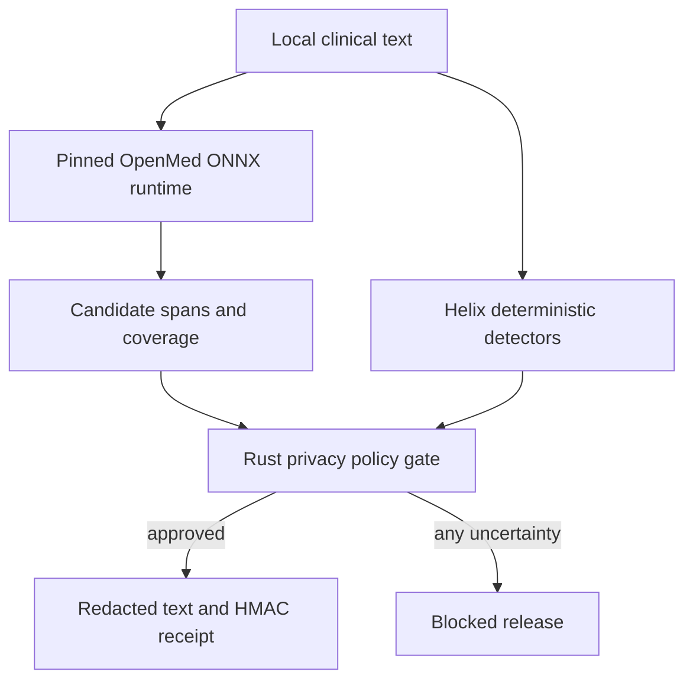

# ADR-050: OpenMed Local Clinical-Text Privacy Gate

**Status**: Accepted
**Date**: 2026-07-13
**Project**: Helix — Personal Health Intelligence (PHI)
**Related**: ADR-001 (local vault), ADR-004 (ontology normalization), ADR-011 (PII-stripped federation), ADR-013 (on-device inference), ADR-019 (privacy-aware routing), OpenMed PR #1550

## Context

OpenMed PR #1550 adds browser, Node, Python, and Android ONNX token-classification
runtimes plus a common span schema. This gives Helix a useful local clinical-text
candidate detector, but the upstream runtime is not itself an authorization boundary.
Its browser helper can load remote models, its high-level API does not prove that a long
document was processed without truncation, and its output offsets follow runtime-specific
string conventions. Its `deidentify` helper also redacts every detected span, including
clinical concepts that Helix needs for local normalization.

A model miss is expected behavior for a probabilistic detector. Helix therefore cannot
equate “the model returned no span” with “the text is safe to disclose.” De-identification
reduces privacy risk; it is not, by itself, a determination of HIPAA compliance.

## Decision

OpenMed is integrated as an untrusted, probabilistic **candidate-span producer** behind a
Rust policy gate. It never directly authorizes network egress, federation, telemetry, or
logging.

The `helix-openmed` crate owns these invariants:

1. Model graphs, tokenizers, external tensor files, and configuration are named in an
   artifact lock with SHA-256 digests and an immutable hexadecimal revision. Moving
   revisions and digest drift fail closed.
2. Callers use `plan_windows` and return a coverage receipt. The gate verifies contiguous
   coverage of every UTF-8 byte. Empty, gapped, truncated, or invalid Unicode windows fail
   closed.
3. OpenMed offsets declare their unit and are converted from UTF-16 code units or Unicode
   scalar indices to canonical UTF-8 byte boundaries before policy is applied.
4. Helix unions model output with deterministic rules for high-value direct identifiers,
   initially email, SSN, phone, IP address, and MRN patterns.
5. Direct identifiers are always redacted. Quasi-identifiers are redacted by default.
   Clinical concepts stay local and remain available to the ADR-004 ontology pipeline.
   An unknown upstream policy label blocks release by default.
6. Audit receipts contain vault-scoped HMACs, model identity, policy version, byte ranges,
   labels, scores, detectors, and actions. They never contain the original span text.
7. Browser execution accepts only same-origin or loopback model URLs, disables remote model
   loading, verifies all locked files before model construction, processes every planned
   window, and submits candidates to the WASM gate. JavaScript cannot produce an approved
   release receipt.

The WASM surface exposes `openmed_plan_windows_json` and `openmed_gate_json`. A vault-scoped
HMAC key of at least 256 bits is supplied as bytes and is never serialized into the request
or receipt.

## Data flow

## Alternatives considered

**Call OpenMed `deidentify` directly.** Rejected because it treats model output as complete,
returns the original input alongside the redacted value, and does not express Helix’s
clinical-concept retention policy.

**Send text to a hosted de-identification API.** Rejected as the default because it moves
raw clinical text outside the user’s local trust boundary before the privacy decision.

**Store OpenMed spans as numeric provenance records.** Rejected because character spans are
not measurements. `ClinicalSpanRecord` is a separate audited type; retained concepts enter
ontology normalization through an explicit downstream mapping.

## Consequences

OpenMed can improve recall without weakening Helix’s local-first guarantees. Model upgrades
are reproducible and reviewable, Unicode behavior is explicit, and incomplete inference
cannot silently approve egress. The cost is extra local inference for overlapping windows,
artifact hosting, and a deterministic ruleset that must be versioned and expanded as new
identifier classes are evaluated.

Production deployments must calibrate thresholds and detector recall on representative,
legally governed data. The included synthetic canaries validate software invariants, not
clinical or regulatory fitness.

## References

- OpenMed PR #1550, “feat: add local ONNX clinical NLP runtimes and model catalog batch”
- NIST SP 800-107 Rev. 1, keyed hash and hash-function security guidance
- HHS, Guidance Regarding Methods for De-identification of Protected Health Information
