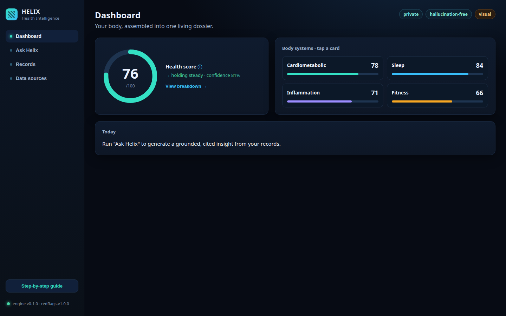
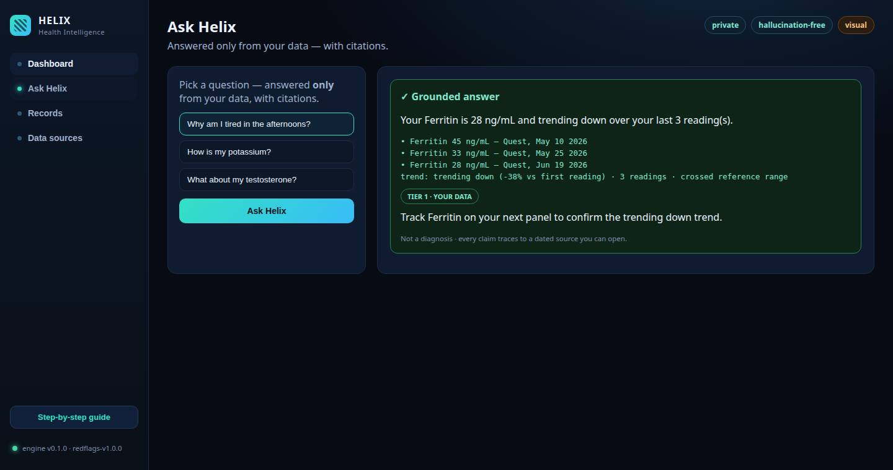
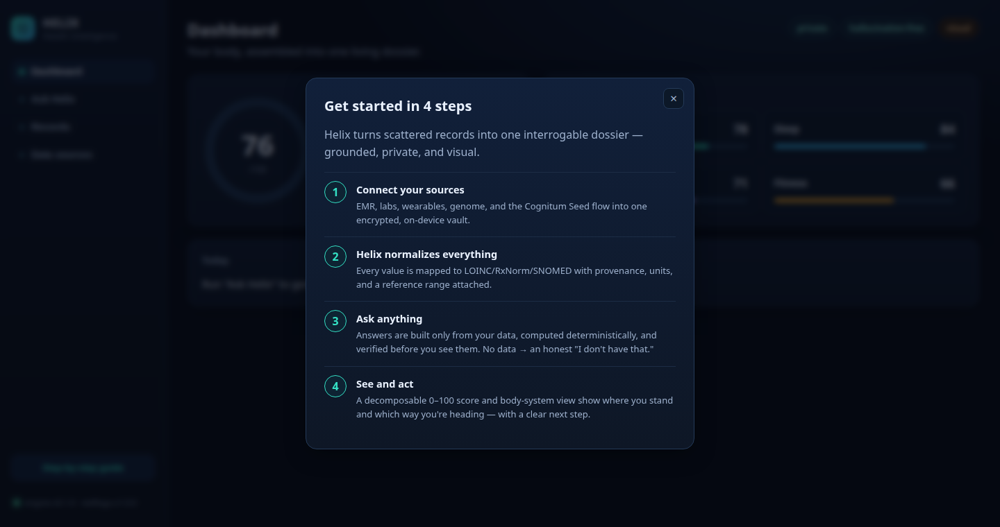
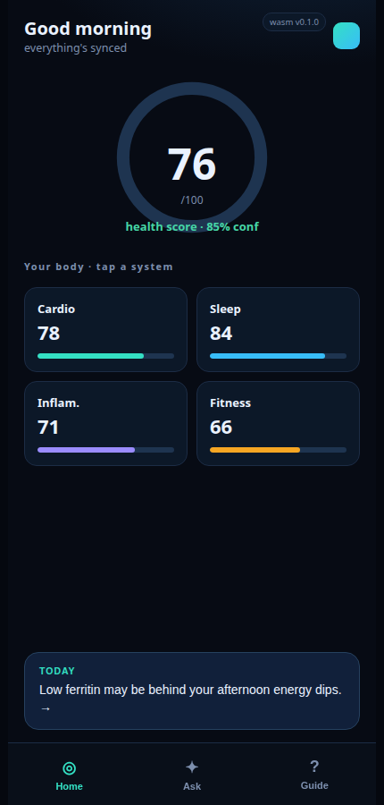
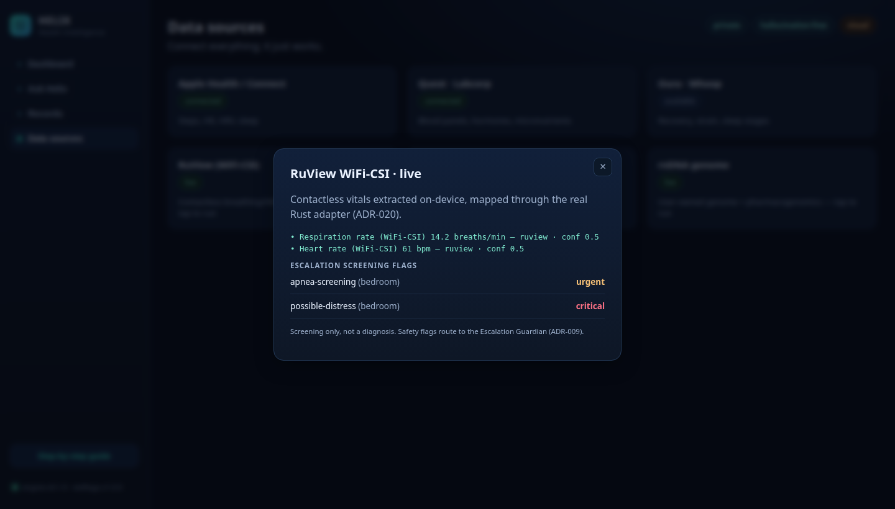
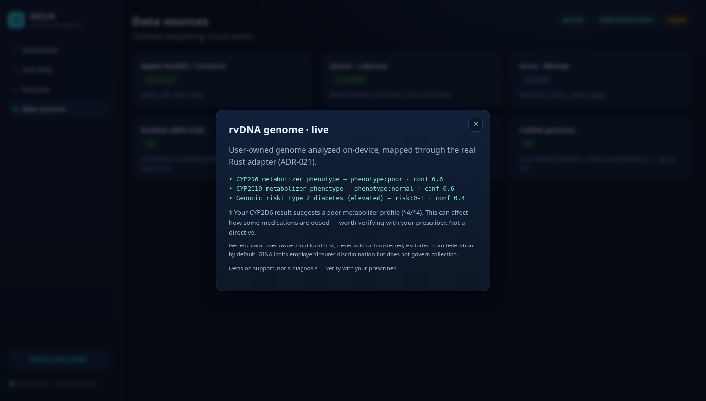

# Helix Management Console — UI Walkthrough

A modern, browser-based management console for Helix. It runs the **real** Rust
anti-hallucination pipeline (`helix-core` + `helix-score`) compiled to
WebAssembly (`helix-wasm`) — there is no business logic duplicated in
JavaScript. `ui/app.js` is presentation and wiring only; every number and every
grounded answer comes from the audited Rust crates.

> The screenshots below are captured from the live UI running the WASM engine
> (headless Chrome render of `ui/index.html`), not mockups — and **each one is a
> clickable link to that exact state in the [live demo](https://ruvnet.github.io/helix/)**.

### Dashboard — a score you can open, a body you can tap
[](https://ruvnet.github.io/helix/ui/)

### Ask Helix — grounded, cited answers (or an honest abstention)
[](https://ruvnet.github.io/helix/ui/#ask)

The ferritin answer above is the real pipeline output: the deterministic engine
computed the trend (`−38% vs first reading · crossed reference range`), every
value is cited to its source and date, and it carries a **Tier 1 · Your data**
evidence chip.

### Step-by-step onboarding guide (modal)
[](https://ruvnet.github.io/helix/ui/#guide)

### Mobile PWA (WASM, installable)
<a href="https://ruvnet.github.io/helix/mobile/"></a>

### Live integrations — ruvnet ecosystem adapters running in the UI
The Data Sources view runs the real Rust integration crates through WASM:

**RuView WiFi-CSI (ADR-020)** — contactless vitals + escalation screening flags:
[](https://ruvnet.github.io/helix/ui/#sensing)

**rvDNA genome (ADR-021)** — pharmacogenomics + prescriber advisory + GINA privacy note:
[](https://ruvnet.github.io/helix/ui/#genome)

---


## Run it locally

```bash
# from helix/
wasm-pack build crates/helix-wasm --target web --out-dir ../../ui/pkg --out-name helix
# (this repo's parent forces the mold linker; if you hit a rust-lld error, prefix: RUSTFLAGS="")
cd ui && python3 -m http.server 8099
# open http://127.0.0.1:8099
```

## Screens (validated in Chrome against live WASM)

### Dashboard
- A **decomposable 0–100 health score** ring — the number (e.g. **76**) is the
  real `compose_score_json` weighted roll-up of the subsystem sub-scores, with
  overall trend and confidence. Tapping ⓘ or "View breakdown" opens a **modal**
  showing each subsystem's weight, confidence, trend, and the composite math.
- A **body-systems** grid (cardiometabolic / sleep / inflammation / fitness),
  each card opening a detail modal that names its driving measurements.

### Ask Helix (the anti-hallucination core)
Pick a question; the answer is built **only** from your records via the WASM
pipeline, and renders one of three honest outcomes:
- **Grounded** — e.g. *"Your Ferritin is 28 ng/mL and trending down over your
  last 3 readings"* with every value cited (source + date), the deterministic
  trend (`−38% vs first reading · 3 readings · crossed reference range`), a
  **Tier 1 · Your data** chip, and a next step. Not a diagnosis.
- **Abstain** — ask about testosterone (no records) and Helix says *"I don't
  have that yet"* with a gap notice, instead of guessing.
- **Escalate** — a critical value (e.g. potassium ≥ 6.0) suppresses optimization
  and routes to "see a clinician now" (ADR-009).

### Records · Data sources
The session's provenance-tagged records, and the connector cards — Apple Health,
Quest/Labcorp, Oura/Whoop, the **Cognitum Seed** (contactless mmWave screening),
**ruv-neural** (40 Hz gamma-entrainment / EEG research signal — screening, not
diagnosis), and user-owned genome import.

### Modals & onboarding
A **step-by-step guide** ("Get started in 4 steps": connect → normalize → ask →
see and act) plus contextual modals for the score, breakdown, and each system.

## How it ties to the ADRs
Every visible behaviour maps to an ADR: grounding+citations (005), evidence
tiers (006), deterministic trend (007), red-flag escalation (009), the
decomposable non-diagnostic score (016), and the data-source model incl. ambient
sensing (014). The UI is the visual layer of ADR-015 driven strictly by the
user's own data.
